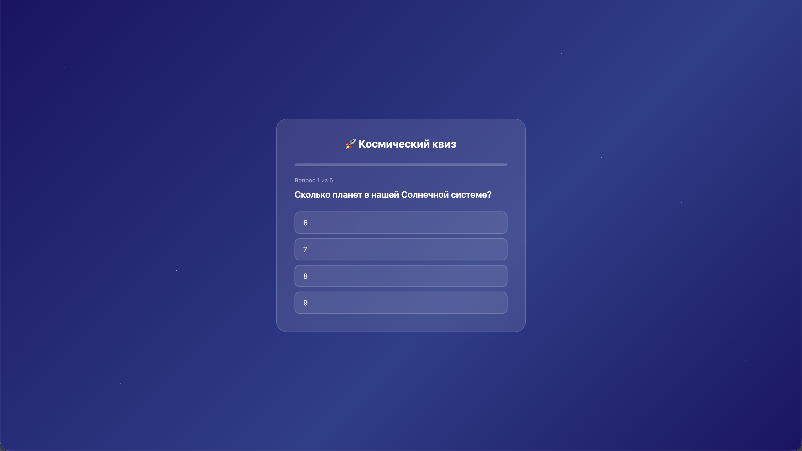
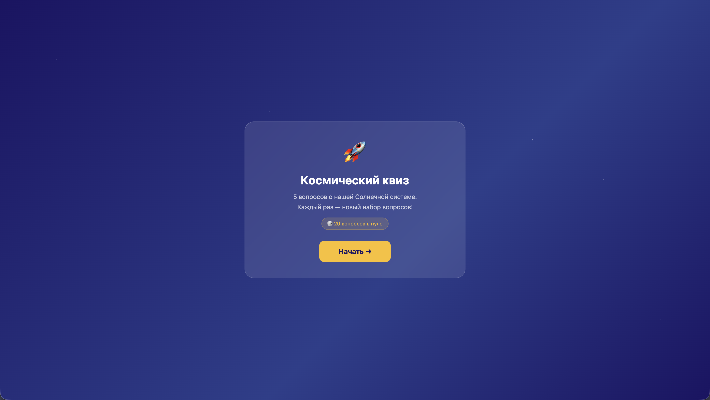

# Космический квиз 🚀
 
Квиз на 5 вопросов про космос — проверь, что ты знаешь о нашей Солнечной системе!
 
## Как играть
1. Открой [ссылку](https://vnikonov-wmt.github.io/solar-system-quiz/) в браузере
2. Читай вопрос и выбирай один из четырёх вариантов
3. После каждого ответа узнаешь — правильно или нет, и почему
4. В конце получишь итоговый результат

## Что внутри
Сделано с: HTML, CSS, JavaScript
 
Вайбкод проект, написанный с помощью Claude Sonnet 4.6
 
## Что изменилось с первой версии
 
**До:** не было экрана старта, вопросы начинались сразу  
**После:** добавил приветственный экран с кнопкой «Начать»
 
**До:** после неправильного ответа ничего не объяснялось  
**После:** теперь всегда показывается правильный ответ и объяснение почему

**До:** 5 повторяющихся вопросов  
**После:** теперь есть 20 вопросов, которые рандомно выбираются каждое прохождение

## Скриншоты
### _v1_

### _v2_

### _v3_

 
Скриншоты — в папке `/screenshots`
 
## Что добавлю дальше
- Таймер на каждый вопрос
- Новые темы: животные, история, кино
- Таблица лучших результатов

## Автор
Вова, 12 лет, WMT Kids 2026
